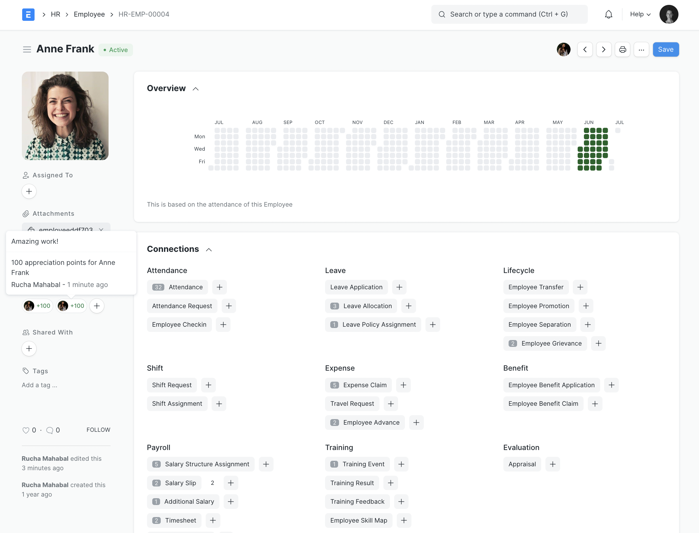

</div>

## Introduction

Frappe HR has everything you need to drive excellence within the company. It's a complete HRMS solution with over 13 different modules right from Employee Management, Onboarding, Leaves, to Payroll, Taxation, and more!



## Key Features

- Employee Management
- Employee Lifecycle
- Leave and Attendance
- Shift Management
- Expense Claims and Advances
- Hiring
- Performance Management
- Fleet Management
- Training
- Payroll
- Taxation
- Compensation
- Analytics

## Installation

### Manual Installation

1. [Install bench](https://github.com/frappe/bench).
2. [Install ERPNext](https://github.com/frappe/erpnext#installation).
3. Once ERPNext is installed, add the hrms app to your bench by running

	```sh
	$ bench get-app hrms
	```
4. After that, you can install the hrms app on the required site by running
	```sh
	$ bench --site sitename install-app hrms
	```


## Learning and Community

1. [Documentation](https://frappehr.com/docs) - Extensive documentation for Frappe HR.

